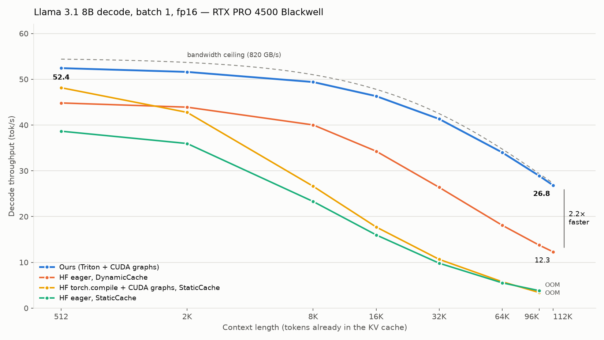

# Llama-3 8B Inference Engine

A from-scratch decode engine for Llama-3/3.1 8B: hand-written Triton kernels, a single
preallocated KV cache, and CUDA graphs — no vLLM, no HF `generate`.

96% of spec memory bandwidth on an RTX PRO 4500 Blackwell (32 GB @ 896 GB/s), level with
vLLM 0.30 at every context length up to 112K tokens, and 2.2x HF eager at 112K.


## Highlights

- **51.6 tok/s at a 512-token context**, batch 1, fp16 — 86% of the spec bandwidth ceiling
  and 94% of what an isolated GEMV actually reaches on this card. Up from 42.3 tok/s on the
  first working commit.
- **Stays at 96–98% of that ceiling out to 112K tokens** (52.4 → 26.8 tok/s). The whole drop
  is bytes: the KV cache grows to half of what each token reads.
- **Level with vLLM 0.30 within 1%** at every context length from 512 to 111K tokens, timed
  the same way.
- **Fused Triton kernels**: RoPE + KV-cache write, split-K flash-decode, RMSNorm with a
  cross-layer residual-add fusion, and a fused gate/up SwiGLU — see
  [`docs/perf_history/OPTIMIZATIONS.md`](docs/perf_history/OPTIMIZATIONS.md) for what each
  one bought.
- **CUDA graphs** for the decode step, gated profiler hooks (off by default — they cost 12%
  of throughput when left on), and Llama 3.1's RoPE frequency scaling for 128K context.

See [`docs/perf_history/REPORT.md`](docs/perf_history/REPORT.md) for the full commit-by-commit
sweep (every commit touching `model.py`/`kernels/` re-benchmarked in its own worktree) and
[`docs/perf_history/LONG_CONTEXT.md`](docs/perf_history/LONG_CONTEXT.md) for the 512→112K
sweep against HF and vLLM.



## Stack

- Triton kernels: fused RoPE + KV-cache write, flash-decode (split-K, online softmax),
  RMSNorm (+ fused residual add), SwiGLU
- Fused QKV and gate/up projections, `(out, in)` weight layout for contiguous GEMV reads
- Single preallocated KV cache, CUDA graph decode
- fp16, PyTorch 2.8 / Triton 3.4
- HuggingFace-equivalent benchmarks (eager, `torch.compile`, CUDA graphs) for comparison

### Tentative additions

- H100/Hopper
- BF16/FP8

## Quickstart

```bash
pip install -r requirements.txt

# tests
make test                          # or: pytest tests/ && python tests/test_flash_decode.py ...

# throughput at a fixed context (logs to benchmarks/results/throughput_runs.csv)
make bench-throughput               # or: python benchmarks/bench_throughput.py
make bench-throughput-graphs        #     python benchmarks/bench_throughput.py --cuda-graphs

# tok/s vs. context length, 512 to 112K, ours vs. HF
make bench-context-sweep            #     python benchmarks/sweep_context.py
```

`make help` lists every target, but most days it's just as easy to call the scripts in
`benchmarks/` directly with `--help` — the Makefile mainly exists to document a few
runnable combinations.

## Layout

```
model.py              Llama forward pass, KV cache, CUDA graph capture
kernels/               Triton kernels (rope, flash_decode, rmsnorm, swiglu, ...)
benchmarks/            throughput/decode-profiling scripts + HF/vLLM comparisons
tests/                 correctness tests (pytest + a few standalone scripts)
docs/perf_history/     the performance write-ups linked above
```

## Docs

- [`docs/perf_history/REPORT.md`](docs/perf_history/REPORT.md) — the full methodology and
  per-commit results (42 commits, including dead ends)
- [`docs/perf_history/OPTIMIZATIONS.md`](docs/perf_history/OPTIMIZATIONS.md) — the short
  version, ranked by measured impact
- [`docs/perf_history/LONG_CONTEXT.md`](docs/perf_history/LONG_CONTEXT.md) — Llama 3.1 RoPE
  scaling and the 512→112K sweep against HF and vLLM
