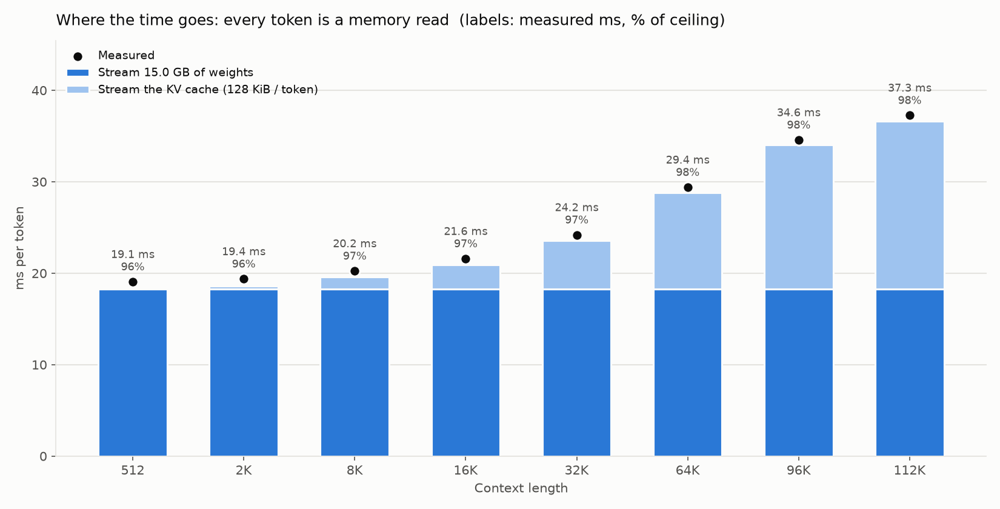
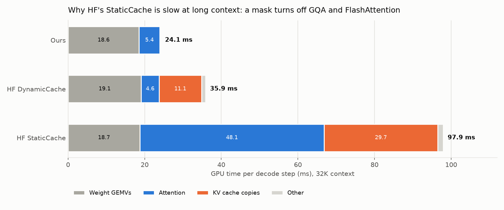
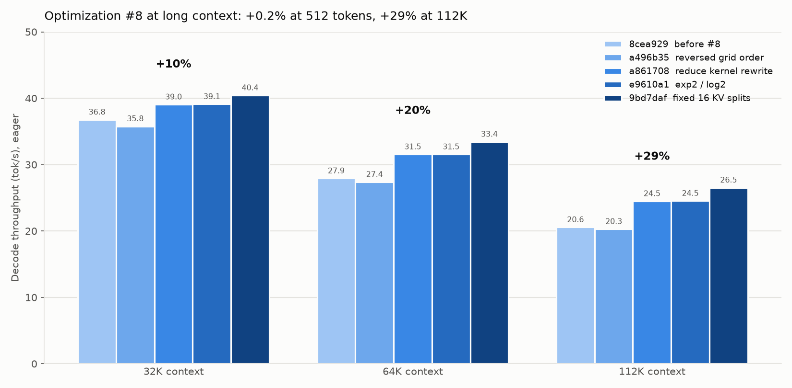

# Long context: Llama 3.1 RoPE and decode from 512 to 112K tokens

*Measured and written 2026-09-26. Later sections are dated in their headings. Last updated 2026-09-26.*

Measured 2026-09-26 on the same RunPod RTX PRO 4500 Blackwell (32 GB, ~896 GB/s spec) as `REPORT.md`: torch 2.8.0+cu128, triton 3.4.0, transformers 5.17.0. Engine code at `a83a976` (`main`, CUDA graphs on), Llama 3.1 8B shape, random fp16 weights, batch 1.


## TL;DR

- **Our engine stays at 96–98% of the practical bandwidth ceiling from 512 to 112K tokens.** Throughput goes from 52.4 to 26.8 tok/s, and all of the drop is bytes: at 112K, the KV cache is half of the 30 GB read per token.
- **The lead over Hugging Face grows from 1.09× to 2.18×.** At short context, HF's `torch.compile` + CUDA graphs is close behind. From 8K on, HF's fastest mode is plain eager with `DynamicCache`.
- **HF's StaticCache modes collapse at long context:** 3.4–3.8 tok/s at 96K, and out of memory at 112K. A StaticCache always passes an attention mask, and in HF's SDPA path a mask turns off native GQA (so K/V get copied out 4× every step) and turns off the FlashAttention kernel.
- **Optimization #8 (the flash-decode polish) is worth +29% at 112K,** after measuring +0.2% at 512. Most of it comes from the reduce-kernel rewrite (`a861708`, +21%), the rest from fixed KV splits (`9bd7daf`, +8%).
- **Our flash-decode kernel matches PyTorch's FlashAttention** (SDPA with native GQA) at every length, kernel against kernel with L2 flushed. Both reach ~775 GB/s at 112K.
- **Llama 3.1 RoPE only needed a new table, not a new kernel.** The 3.1 scaling changes each dimension pair's frequency once. Position isn't involved, so the fused RoPE kernel just reads different `cos`/`sin` rows.
- **The largest context that fits is 112K.** Weights take ~15 GiB and the KV cache 128 KiB per token; 120K runs out of memory on the 32 GB card.

## Llama 3.1 RoPE scaling

Until now the engine used plain Llama 3 RoPE (8K context). Llama 3.1 extends it to 128K by rescaling the per-pair inverse frequencies `θ_j = 500000^(-2j/d)`, grouped by how many full rotations a pair makes over the original 8K context (`rotations = 8192 · θ_j / 2π`):

| rotations in 8K tokens | frequency band | Llama 3.1 |
|---|---|---|
| ≥ 4 (`high_freq_factor`) | high: training saw every angle | keep θ |
| < 1 (`low_freq_factor`) | low: the pair never completed a circle in training | θ / 8 (`factor`) |
| 1 – 4 | in between | linear blend of the two |

The blend is continuous at both edges, so `<` vs `≤` at the cutoffs doesn't matter. The scaling doesn't depend on position, and `attention_factor` is 1.0 (unlike YaRN), so:

- `precompute_rope_freqs_llama31` (`model.py`) scales the frequencies, then builds the same `(max_seq_len, head_dim/2)` table as before, using the shared helpers `_rope_inv_freq` and `_rope_table`. `precompute_rope_freqs(config)` picks the variant from `config.rope_scaling`. `from_pretrained` reads `rope_scaling` from `config.json`, where HF names this scheme `rope_type: "llama3"`.
- `fused_rope_cache_kernel` is unchanged. It reads row `cache_pos` of whatever table it's given. The 128K fp32 table is 64 MiB.

**Tests.**

- `tests/test_rope.py` checks the scaled frequencies band by band against `transformers.modeling_rope_utils.ROPE_INIT_FUNCTIONS["llama3"]`. It also checks the cos/sin table against float64 ground truth and against HF's `LlamaRotaryEmbedding` at positions around both cutoffs and out to 131071.
  - The tolerance grows with the angle: `m · θ` is rounded to fp32, and at m ≈ 131K one fp32 step is 0.0156 rad. Our table is off by 1.3e-3 from exact there, and HF's is off by 3.7e-3, so a fixed `atol` can't work.
- `tests/test_forward.py` now has an end-to-end Llama 3.1 test. It uses a small model with the real 8B head geometry (head_dim 128, θ 500K, GQA 4:1). Both KV caches get the same random context, then the test decodes from positions 4096, 8190 (across the 8K edge), 20000 and 100000 and compares logits and argmax with HF. The match is about 2.5e-3, within a 1e-2 tolerance.
  - **Negative control:** the same run with plain Llama 3 RoPE must miss by more than 10× the tolerance (in probes it missed by 0.38–0.88). That shows the test can tell the two apart. With the old test's weight scale (std 0.02) attention is nearly uniform and a wrong rotation barely changes the output, so the test raises the q/k weights to std 0.05.

**A pitfall the test caught.** `LlamaForCausalLM(cfg).to(device, dtype=torch.float16)` also casts HF's RoPE `inv_freq` buffers to fp16. That ~5e-4 relative error is multiplied by the position, so by position 20K HF's rotation angles are off by radians, while HF fp16 and fp32 still agree with each other. Before this was understood, our engine looked 20% off in attention output at 20K. Checking against an HF model with fp32 frequencies showed that our engine was right and the reference was wrong. Real checkpoints loaded with `from_pretrained(dtype=...)` keep `inv_freq` in fp32. The test helper `_hf_model` recomputes the frequencies after the cast, and the older short-position tests use it too; they never reached positions where this mattered.

## Benchmark changes

- **`bench_throughput.py`** uses the Llama 3.1 config and sizes the KV cache to the positions the run touches (`seq_len + warmup + decode_steps`, override with `--kv-len`). It used to allocate `max_position_embeddings` rows, which is 16 GiB at 128K. Flash-decode only reads `seq_len` rows, so this doesn't change timings: 512 context still measures 52.3–52.4 tok/s.
- **`bench_throughput_hf.py`** has `--mode {eager-dynamic, eager-static, compile-static, compile-cg}`, replacing `--compiled`/`--static-cache`, with the Llama 3.1 config.
  - StaticCache follows transformers 5.x: no `batch_size` argument, and the internal write counter is set to the prefilled length.
  - Both caches are filled by writing random K/V straight into the cache tensors. A `seq_len`-token prefill forward would build a `seq_len × seq_len` causal mask, about 8 GiB at 64K. Checked: after the direct fill, one decode step gives the same logits as a DynamicCache holding the same K/V (max difference 1.2e-3).
  - The StaticCache is sized exactly to the positions used, so SDPA never attends over empty rows.
- **`benchmarks/run_log.py`**: both benches log to `benchmarks/results/throughput_runs.csv`, which has new columns `impl` (custom/hf), `mode` and `kv_len`. Older rows are backfilled with `impl=custom`.
- **`benchmarks/sweep_context.py`** / `make bench-context-sweep`: runs each (context, implementation) in its own process, so an OOM only loses that cell, and prints the table below.

Reproduce:

```bash
python benchmarks/sweep_context.py --tag ctx-v1          # ~25 min; each compile-cg cell compiles from scratch
python docs/perf_history/long_context_charts.py          # needs matplotlib
```

## Results

tok/s, 128 timed decode steps after 30 warmup steps, one run per cell. The ceiling divides the bytes per token (15.01 GB of weights plus 128 KiB of KV per cached token) by the ~820 GB/s the best isolated GEMVs reach on this card (see `REPORT.md`).

| context | ours (CUDA graphs) | HF eager, DynamicCache | HF eager, StaticCache | HF compile + CUDA graphs, StaticCache | ours vs best HF | ours GB/s | % of ceiling | KV share of bytes |
|---:|---:|---:|---:|---:|---:|---:|---:|---:|
| 512 | **52.4** | 44.8 | 38.7 | 48.1 | 1.09× | 790 | 96% | 0% |
| 2K | **51.6** | 43.9 | 36.0 | 42.8 | 1.18× | 788 | 96% | 2% |
| 8K | **49.4** | 40.0 | 23.3 | 26.6 | 1.23× | 794 | 97% | 7% |
| 16K | **46.3** | 34.3 | 16.0 | 17.7 | 1.35× | 794 | 97% | 13% |
| 32K | **41.3** | 26.4 | 9.8 | 10.7 | 1.57× | 798 | 97% | 22% |
| 64K | **34.0** | 18.1 | 5.5 | 5.8 | 1.88× | 803 | 98% | 36% |
| 96K | **28.9** | 13.8 | 3.8 | 3.4 | 2.10× | 807 | 98% | 46% |
| 112K | **26.8** | 12.3 | OOM | OOM | 2.18× | 806 | 98% | 50% |

Raw data: `long_context_sweep.csv` (also in the run log, note `ctx-sweep ctx-v1`).

### Our engine is bandwidth-bound at every length



Measured time per token tracks "stream the weights, then stream the KV cache" within 2–4% at every length. Flash-decode reads the cache as efficiently as cuBLAS reads the weights.

Before this sweep I expected the fixed 16 KV splits to hurt at long context: 16 splits × 8 KV heads is 128 CTAs on 82 SMs, about 1.56 waves. The data doesn't show that: achieved bandwidth rises slightly with context (790 → 806 GB/s). Tuning the split count has little left to gain at batch 1.

### Why HF's StaticCache collapses



GPU time per decode step at 32K, from `torch.profiler` (one step after warmup; raw data in `long_context_breakdown_32k.csv`):

| | ours | HF DynamicCache | HF StaticCache |
|---|---:|---:|---:|
| Weight GEMVs | 18.6 | 19.1 | 18.7 |
| Attention | 5.4 (flash-decode) | 4.6 (FlashAttention split-KV) | **48.1** (CUTLASS mem-efficient) |
| KV cache copies | – | 11.1 (`torch.cat` every step) | **29.7** (`repeat_kv`) |
| Other | 0.2 | 1.0 | 1.4 |
| **Total** | **24.1 ms** | **35.9 ms** | **97.9 ms** |

Preallocation isn't the problem; it saves allocator calls and is what makes `torch.compile` + CUDA graphs possible. What matters at long context is the attention path:

1. **A StaticCache always needs an attention mask,** because it holds `max_cache_len` rows and the unfilled ones must be masked. A DynamicCache with one query token needs no mask.
2. **A mask turns off SDPA's native GQA** (`transformers.integrations.sdpa_attention.use_gqa_in_sdpa`). HF then calls `repeat_kv`, which copies the 8 KV heads out to 32 on every layer and every step. At 32K that's 128 MB read and 512 MB written per layer, about 20 GB per step: the 29.7 ms of copies. The same copies cause the OOM at 112K.
3. **A mask also rules out the FlashAttention kernel,** so SDPA uses the mem-efficient kernel. That kernel has no split-KV: with one query token it launches about one CTA per head (32 on 82 SMs), and each walks all 32K keys in sequence. That's the 48 ms.

`torch.compile` doesn't help, because it compiles the same `repeat_kv` + masked-SDPA graph. DynamicCache avoids both problems but pays for `torch.cat` rewriting the whole cache every step. That means reading the KV cache three times instead of once: about 1.45× our bytes at 32K and 2× at 112K.

The HF baseline isn't misconfigured: `generate(cache_implementation="static")` takes the same path. HF `transformers` is a reference implementation built for breadth and correctness. Serving engines (vLLM, SGLang, TensorRT-LLM) use split-KV decode kernels, paged KV caches and CUDA graphs. At batch 1 in fp16 they should land near the same bandwidth ceiling as ours; they haven't been measured here.

A caveat on the attention row: taken at face value, HF DynamicCache's FlashAttention time would mean reading KV at ~925 GB/s, above the 896 GB/s spec. The `torch.cat` just before it leaves part of the new cache in L2. With L2 flushed, the two kernels run level (see "Flash-decode vs PyTorch's FlashAttention" below), so "4.6 vs 5.4 ms" says more about cache warmth than about the kernels.

## Optimization #8 at long context (2026-09-26)



`OPTIMIZATIONS.md` credited the flash-decode polish (#8) with only +0.2 tok/s, because it was measured at 512 tokens, where attention is 2% of the bytes. This reruns the commits around it at long context. The method is the same as the original study (`REPORT.md`): each commit in its own worktree, profiler hooks stubbed, 3 warmup runs + 5 timed runs of 128 steps, median. It uses `harness/bench_ctx.py`, a copy of the study's `bench_fixed.py` that sizes `max_position_embeddings` and the KV cache to the run. All runs are eager, since the old commits predate CUDA graphs.

tok/s (min–max spread across the 5 runs was ≤ 0.2 tok/s everywhere):

| commit | change | 512 | 8K | 32K | 64K | 112K |
|---|---|---:|---:|---:|---:|---:|
| `8cea929` | before #8 (after the fused add + RMSNorm, #7) | 51.14 | 47.18 | 36.77 | 27.92 | 20.56 |
| `a496b35` | reversed Triton grid order | | | 35.77 | 27.38 | 20.29 |
| `a861708` | reduce kernel: raw pointers, running max/denominator instead of per-block log-sum-exp | | | 39.05 | 31.54 | 24.49 |
| `e9610a1` | `exp2`/`log2` with a log2(e)-prescaled scale | | | 39.11 | 31.54 | 24.53 |
| `9bd7daf` | fixed 16 KV splits, each looping over its KV blocks | 51.22 | 48.12 | 40.43 | 33.44 | 26.53 |
| `1f28138` | HEAD, eager | 51.17 | 48.16 | 40.43 | 33.44 | 26.54 |
| `1f28138` | HEAD, CUDA graphs | 52.43 | 49.34 | 41.27 | 33.91 | 26.87 |

- **The whole bundle: +0.2% at 512, +2% at 8K, +10% at 32K, +20% at 64K, +29% at 112K.** At 112K it takes 11 ms off every token (48.6 → 37.7 ms). The KV read beyond the 512-token baseline goes from ~515 GB/s to ~825 GB/s.
- **The reduce-kernel rewrite (`a861708`) is most of it: +21% at 112K.** Before `9bd7daf`, the generation kernel wrote one partial result per KV block, hundreds to thousands per head at 112K (448–3,584 depending on the autotuned block size), and the reduce kernel looped over all of them with a block pointer and a full log-sum-exp per block. Raw pointers and a running max/denominator made that loop much cheaper.
- **Fixed splits (`9bd7daf`) add another +8%.** Sixteen splits per head each loop over their blocks inside one program, so the reduce kernel only combines 16 partial results however long the context. This is also what made CUDA graphs possible later (a fixed grid).
- **The reversed grid order (`a496b35`) costs 1–3% at long context,** and `exp2` is neutral. Both are small beside the two changes above.
- Nothing after `9bd7daf` touched attention: HEAD eager matches it to 0.01 tok/s. CUDA graphs save a near-constant 0.42–0.50 ms per token.

Raw data: `long_context_milestones.csv`. Reproduce: `docs/perf_history/harness/sweep_milestones.sh` (about 30 minutes; creates worktrees under `harness/wt/`).

## Flash-decode vs PyTorch's FlashAttention, kernel only (2026-09-26)

One attention call (32 query heads, 8 KV heads, head_dim 128, batch 1), from `kernels/benchmarks/bench_decode_vs_sdpa.py`. It times with `triton.testing.do_bench`, which flushes L2 between runs. SDPA is called with `enable_gqa=True` and no mask, which selects PyTorch's FlashAttention kernel: the same path HF's DynamicCache mode takes. Tri Dao's `flash_attn` package isn't installed here and wasn't compared.

| KV length | flash-decode (ms) | SDPA + GQA (ms) | flash-decode GB/s | SDPA GB/s |
|---:|---:|---:|---:|---:|
| 512 | 0.0124 | 0.0143 | 170 | 146 |
| 2K | 0.0208 | 0.0248 | 403 | 339 |
| 8K | 0.0547 | 0.0560 | 613 | 599 |
| 16K | 0.0963 | 0.0999 | 697 | 672 |
| 32K | 0.1823 | 0.1853 | 736 | 724 |
| 64K | 0.3484 | 0.3560 | 771 | 754 |
| 112K | 0.6065 | 0.6104 | 774 | 770 |
| 128K | 0.6897 | 0.6906 | 778 | 777 |

- **Ours is 15–19% faster up to 2K, 2–4% faster from 8K to 64K, and level from 112K up** (SDPA time ÷ ours). At long context both are limited by the same memory bandwidth.
- **Short contexts are latency-bound, not bandwidth-bound:** 12 µs to read 2 MB. At 512 tokens attention is ~0.4 ms of a 19 ms token, so this doesn't show up end to end.
- The benchmark now passes `seq_len` as a device tensor, like the model does. Before, a Python int added a host-to-device copy to every timed call.

Raw data: `flash_decode_kernel.csv`.

## Caveats

- One run per cell, no repeats. At 512 the numbers match earlier runs (52.3–52.7 ours, 44.8 HF eager, 48.1–48.2 HF compile + graphs), so run-to-run noise looks well under 1%.
- The logged rows are marked `dirty=True`: the benchmark harness was uncommitted when they ran. The engine code (`model.py`, `kernels/`) was at `a83a976`.
- Random weights, and random K/V for the prior context. Throughput doesn't depend on the values; the correctness tests above cover the math.
- HF runs use SDPA. `attn_implementation="flash_attention_2"` needs the optional `flash-attn` package and wasn't measured.

## Next

- vLLM at batch 1, as the production-engine baseline.
- HF with `attn_implementation="flash_attention_2"` (needs the `flash-attn` package).
- Beyond batch 1: batching (fix the `swiglu_out` batch > 1 bug first) and lower-precision weights and KV. Those move the ceiling itself.
