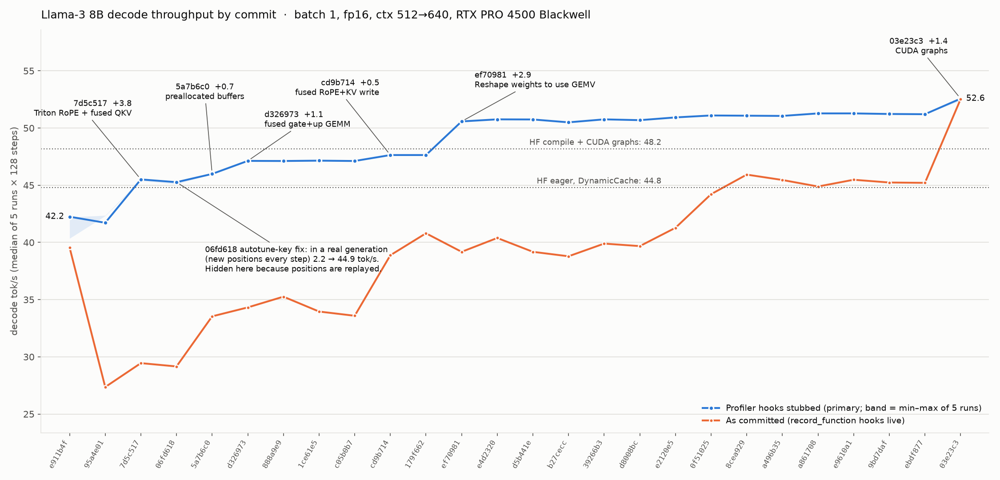

# Performance history — LLaMA-3 8B decode engine

Measured 2026-09-25 on a RunPod RTX PRO 4500 Blackwell (32 GB, ~896 GB/s spec), AMD EPYC 7663 host (shared, load avg ~6–8), torch 2.8.0+cu128, triton 3.4.0, transformers 5.17.0.
Every commit that touches `model.py` or `kernels/` was checked out into its own `git worktree` and run against one frozen benchmark. `main` and the working tree were never modified during the measurements.



## TL;DR

- **The first working engine (`e911b4f`) runs at 42.3 tok/s, and HEAD runs at 51.2 tok/s (+21%).** That is 92% of this card's weight-streaming ceiling: 16.06 GB of fp16 weights at 896 GB/s is about 55.8 tok/s.
- **The "29 → 49 tok/s" story is mostly profiler overhead.** `95a4e01` wrapped every op in `torch.profiler.record_function` (483 scopes per decode step, still 387 at HEAD). These scopes cost CPU time even when no profiler is running. The loop has no CUDA graphs and is CPU-bound, so that cost lands directly on tok/s.
  - As committed, the history reads **27.4 → 45.2 tok/s**, which matches your THROUGHPUT_LOG.
  - With the hooks stubbed out it reads **42.3 → 51.2**.
  - The hooks still cost **6 tok/s (−12%) at HEAD**.
- **Why you saw ~40 yesterday and 47–49 before:** with hooks on, every commit is CPU-bound. CPU enqueue time equals wall time in all hooks-on runs. The number therefore tracks host single-thread speed and noisy neighbours on a shared RunPod host, not your code. Today the hooks-on HEAD figure moved between 42.5 and 45.8 across 5 runs in one process. With hooks off it moves by less than 0.02.
- **The biggest real-world fix is invisible to a fixed benchmark.** Before `06fd618`, flash-decode autotuned on `seq_len`, so every new token re-ran the autotuner. With non-repeating positions (a real generation), `7d5c517` does **2.2 tok/s** and `06fd618` does **44.9 tok/s**, about 20×.
- **Your THROUGHPUT_LOG called `ef70981` (weight layout for GEMV) a ~4% regression. It is actually the second-largest GPU win (+2.9 tok/s, +6%).** The regression only shows with hooks on, where the extra `.T` view calls cost more CPU time than the GPU saves.
- **HF check:**
  - HF eager (DynamicCache): 44.8 tok/s. Your own `bench_throughput_hf.py`, unmodified, gives 43.2 eager and 45.0 compiled, matching your old log (43.1 / 45.7).
  - HF `torch.compile` + StaticCache: 46.7 tok/s. With CUDA graphs (`mode="reduce-overhead"`): 48.2 tok/s.
  - HEAD beats all of these with hooks off (51.2, +6% over HF compile + CUDA graphs). With hooks on (45.2) it only ties HF eager.

## Methodology

> This is branch **`perf-history-sweep`**: `main` plus the one-off sweep harness (`harness/`) and per-run data (`raw/`). `main` keeps only the findings.

| | |
|---|---|
| Benchmark | `harness/bench_fixed.py`, derived from `benchmarks/bench_throughput.py @ 40dc0b6` and stored outside the repo |
| Model | Llama-3 8B shape (`LlamaConfig()` defaults), random fp16 weights (seed 0), batch 1 |
| Workload | KV cache pre-filled with 512 random tokens. One run = 128 decode steps at positions 512..639, replayed identically every run |
| Measurement | 3 warmup runs, then 5 timed runs. `torch.cuda.synchronize()` before and after each run, wall-clock `perf_counter`. Report the median tok/s. CUDA events and CPU enqueue time are recorded too |
| Primary number | `record_function` replaced with a no-op context manager before `import model` ("hooks stubbed"). A second full sweep ran the code as committed ("hooks-on") |
| Isolation | Each commit runs in a fresh process with `sys.path[0] =` its worktree. The editable-install finder for `/workspace/inference` is removed from `sys.meta_path`, and the harness asserts every `model`/`kernels` module loaded from the worktree |
| Noise | Three no-op commits (`888a9e9`, `1ce61e5`, `c05b0b7`) land within ±0.03 tok/s. Min–max within 5 runs is ≤0.03 for every commit after `7d5c517`. The two earliest commits are partly CPU-bound and noisier, so they were re-run twice (¹ in the table; the bold value is the median of the three sweeps) |

**Adapters.** These are benchmark-side only; no engine code was changed.

1. Weight names and layouts changed across history (`wq/wk/wv` → `wqkv`, `w_gate/w_up` → `w_gate_up`, (in,out) → (out,in)). So instead of assigning hard-coded names, the harness walks the model and replaces every tensor `__init__` created with `randn*0.02` fp16 **of the same shape**. `cos`/`sin` tables are just moved to CUDA.
2. `record_function` is stubbed for the primary sweep, as described above.
3. For the HF runs, transformers 5.x `StaticCache` no longer accepts `batch_size` and ignores the `cache_position` you pass (it writes at its own internal `cumulative_length`). The HF harness rewinds that counter before each run.

**Caveats.**

- Replaying the same 128 positions lets Triton's per-key autotune cache warm up during warmup. That hides the pre-`06fd618` re-tuning cost; see "Autotune side test" below.
- At a 512-token context, attention is a small share of the step. The flash-decode kernel work (`a496b35`…`9bd7daf`) was aimed at long context and can't show much here.
- Random weights take the same code paths as real weights. All outputs were checked to be finite.
- `from_pretrained` isn't exercised. Before `ef70981` it stored `.T` views of HF weights, which is already the "after" layout, so real-checkpoint runs of pre-`ef70981` commits may have been faster than this benchmark (and your old `bench_throughput.py`) shows.

## Results

The Δ column is taken against the previous successful commit, using the best estimate. The hooks-on column is the same benchmark with the code as committed.

| # | commit | date | message | what the diff actually changed | tok/s (median) | Δ vs prev | hooks-on tok/s | notes |
|---|---|---|---|---|---:|---:|---:|---|
| 1 | `139f8f1` | 2026-06-04 | Fix RMSNorm kernel call and add fused RMSNorm+SWIGLU batch dim | First model.py skeleton (RMSNorm/Attention/MLP classes); Llama.forward is a stub | FAIL | — | FAIL | `warmup`: NotImplementedError: . Not runnable: forward raises NotImplementedError |
| 2 | `1d59c2e` | 2026-06-05 | Prune return for decode kernel | flash_decode: drop unused return values | FAIL | — | FAIL | `warmup`: NotImplementedError: . Not runnable (forward stub) |
| 3 | `ea91968` | 2026-06-05 | First pass impl of RoPe | PyTorch RoPE (freqs_cis complex) in model.py | FAIL | — | FAIL | `warmup`: NotImplementedError: . Not runnable (forward stub) |
| 4 | `c0e5b75` | 2026-06-08 | Create pyproject | Adds kernels/__init__.py + pyproject (package layout) | FAIL | — | FAIL | `warmup`: NotImplementedError: . Not runnable (forward stub) |
| 5 | `c0bcafc` | 2026-06-08 | Update fd to new blockptr API and add batch dim | flash_decode ported to block-ptr API + batch dim | FAIL | — | FAIL | `warmup`: NotImplementedError: . Not runnable (forward stub) |
| 6 | `8a9a61a` | 2026-06-08 | Add softmax masking for non-nice seqlen | flash_decode: mask tail KV block for seq_len not multiple of BLOCK | FAIL | — | FAIL | `warmup`: NotImplementedError: . Not runnable (forward stub) |
| 7 | `df1fff2` | 2026-06-09 | Write and test first-pass model attention forward with FD kernel | Attention.__call__ implemented (x@wq/wk/wv, PyTorch RoPE, FD kernel) | FAIL | — | FAIL | `warmup`: NotImplementedError: . Not runnable (forward stub) |
| 8 | `c7d66d4` | 2026-06-09 | Clean up RoPe funcs | RoPE helper cleanup (rotate_half) | FAIL | — | FAIL | `warmup`: NotImplementedError: . Not runnable (forward stub) |
| 9 | `820da53` | 2026-06-09 | Move FD batch grid index to axis 0 | flash_decode grid: batch moved to axis 0 | FAIL | — | FAIL | `warmup`: NotImplementedError: . Not runnable (forward stub) |
| 10 | `3fb1ca1` | 2026-06-09 | Correct RMSNorm output type cast | RMSNorm kernel output dtype cast fix | FAIL | — | FAIL | `warmup`: NotImplementedError: . Not runnable (forward stub) |
| 11 | `376fc0a` | 2026-06-09 | Write and test first-pass DecoderLayer pipeline | DecoderLayer implemented | FAIL | — | FAIL | `warmup`: NotImplementedError: . Not runnable (forward stub) |
| 12 | `c9466dc` | 2026-06-10 | Write and test first-pass impl full llama model forward call | Llama.forward implemented (embed -> layers -> norm -> lm_head) | FAIL | — | FAIL | `warmup`: TypeError: 'module' object is not callable. Fails: model.py does `import kernels.rmsnorm as rmsnorm` then calls the module |
| 13 | `47f2485` | 2026-06-10 | Generate load from pretrain and clean up imports | from_pretrained weight loading; import cleanup | FAIL | — | FAIL | `warmup`: TypeError: 'module' object is not callable. Fails: same module-not-callable import bug |
| 14 | `faa0fad` | 2026-06-10 | Remove sync call | Removes a torch.cuda.synchronize() inside flash_decode | FAIL | — | FAIL | `warmup`: TypeError: 'module' object is not callable. Fails: same import bug (so the sync removal can't be measured in isolation) |
| 15 | `f29a855` | 2026-06-11 | Add autotuning to flash decode | triton.autotune on flash-decode generation kernel, key=[seq_len, head_dim] | FAIL | — | FAIL | `warmup`: TypeError: 'module' object is not callable. Fails: same import bug. Autotune key includes seq_len -> re-tunes on every new decode position |
| 16 | `e911b4f` | 2026-06-11 | Update kernel module structure | kernels/__init__ re-exports functions; fixes import bug | 41.08 → **42.25**¹ | — | 39.56 | FIRST RUNNABLE COMMIT. Baseline: PyTorch RoPE (~10 small ops/layer), separate q/k/v/gate/up GEMMs, per-step allocations |
| 17 | `95a4e01` | 2026-06-12 | Migrate torch profiling to model.py | Wraps every op in torch.profiler.record_function (15 scopes/layer → 483 per decode step); otherwise same ops (v proj moved before RoPE) | 42.33 → **41.72**¹ | -0.53 (-1.3%) | 27.36 | Hooks-on column is where the profiler cost appears; primary column stubs record_function |
| 18 | `da06b00` | 2026-06-15 | Add basic RoPe kernel | Adds Triton rope_decode kernel; changes cos/sin tables to head_dim/2 but model still uses PyTorch RoPE | FAIL | — | FAIL | `warmup`: RuntimeError: The size of tensor a (128) must match the size of tensor b (64) at non-singl. Fails: RoPE shape mismatch (128 vs 64) |
| 19 | `5911924` | 2026-06-12 | [Optimize] Concat QKV proj matrix and update test/weights loading | Concatenates wq/wk/wv into one wqkv GEMM + torch.split | FAIL | — | FAIL | `warmup`: RuntimeError: The size of tensor a (128) must match the size of tensor b (64) at non-singl. Fails: RoPE shape mismatch inherited from da06b00. QKV fusion is only measurable bundled into 7d5c517 |
| 20 | `7d5c517` | 2026-06-15 | Refactor model with new RoPe kernel | model.py switches to Triton apply_rope_decode (q and k) | 45.51 | +3.79 (+9.1%) | 29.45 | BUNDLE: first measurable commit after da06b00+5911924, so it carries Triton RoPE + fused QKV GEMM |
| 21 | `06fd618` | 2026-06-16 | Remove FD sequence as optim parameter, causing recompilation every step | flash-decode autotune key drops seq_len (key=[head_dim]) | 45.27 | -0.24 (-0.5%) | 29.16 | Fixed benchmark replays the same 128 positions, which hides per-seq_len re-tuning; see fresh-position side test |
| 22 | `5a7b6c0` | 2026-06-16 | Update kernels to use existing output and preallocate output tensors in model.py | *_out kernel variants + preallocated per-layer output buffers; matmul(out=); mid_lse.fill_(-inf) added | 45.99 | +0.72 (+1.6%) | 33.54 | Removes per-step torch.empty/zeros allocations |
| 23 | `d326973` | 2026-06-16 | Fuse MLP up proj and gate | Concatenates gate/up weights into one w_gate_up GEMM + split | 47.13 | +1.14 (+2.5%) | 34.32 | One 4096x28672 GEMV instead of two 4096x14336 |
| 24 | `888a9e9` | 2026-06-16 | Add max position embeddings to layers init | Buffer sizing uses config.max_position_embeddings instead of hard-coded 8192 | 47.12 | -0.01 (-0.0%) | 35.26 | No-op for this config (8192 either way); acts as a noise control |
| 25 | `1ce61e5` | 2026-06-16 | Write fused rope + cache write kernel | Adds fused_rope_cache.py kernel file (not imported) | 47.15 | +0.03 (+0.1%) | 33.96 | No runtime change; noise control |
| 26 | `c05b0b7` | 2026-06-16 | Clean up fused_rope_cache and fix bugs | Exports fused_rope_cache from kernels/__init__; kernel bugfixes | 47.12 | -0.03 (-0.1%) | 33.59 | Kernel still unused by model.py; noise control |
| 27 | `cd9b714` | 2026-06-16 | Add fuse kernel into model.py | Attention uses fused_rope_cache_decode_out: RoPE(q,k) + K/V cache write in one kernel | 47.64 | +0.52 (+1.1%) | 38.88 | Replaces split/view/transpose + 2 RoPE launches + 2 slice-assign copies |
| 28 | `179f662` | 2026-06-17 | Remove KV cache slicing for flash decode | flash_decode takes explicit seq_len; stops slicing K[:, :, :pos+1] | 47.64 | +0.00 (+0.0%) | 40.8 | Saves 2 view creations per layer (CPU only) |
| 29 | `ef70981` | 2026-06-17 | Reshape weights to use GEMV on affine ops | Weights stored (out,in) HF-native; matmuls use W.T (column-major) for GEMV dispatch | 50.58 | +2.94 (+6.2%) | 39.18 | Changes the cuBLAS kernel chosen for every projection + lm_head |
| 30 | `e4d2320` | 2026-06-17 | Remove -inf fill on LSE for flash decode | Removes mid_lse.fill_(-inf) before flash-decode | 50.76 | +0.18 (+0.4%) | 40.39 | One fewer launch per layer |
| 31 | `d5b441e` | 2026-06-17 | Pass in cos sin table to rope instead of slicing | RoPE kernel indexes full cos/sin tables with cache_pos instead of per-step slicing | 50.75 | -0.01 (-0.0%) | 39.18 | Removes 2 slice ops per step (CPU only) |
| 32 | `b27cecc` | 2026-06-17 | Remove unecessary RMSNorm autotune | RMSNorm: drop autotuned BLOCK_SIZE list/prune; BLOCK_SIZE=next_pow2(N), autotune num_warps only | 50.5 | -0.25 (-0.5%) | 38.79 | Also removes unused fused_rmsnorm_swiglu export |
| 33 | `39266b3` | 2026-06-17 | Add fused add rmsnorm kernel | Adds fused_add_rmsnorm kernel (not yet used by model.py); deletes fused_rmsnorm_swiglu | 50.76 | +0.26 (+0.5%) | 39.9 | No model.py change; noise control |
| 34 | `d8008bc` | 2026-06-17 | Add ping pong buffering to optimize decoder layer buffer sharing | Shared BufferPool with ping/pong hidden buffers across all layers | 50.69 | -0.07 (-0.1%) | 39.68 | Memory/structure change; same kernel count |
| 35 | `e2120e5` | 2026-06-17 | Make rmsnorm residual add fusion for postnorm | Post-attention residual add + RMSNorm fused (FusedAddRMSNorm); autotune removed from that kernel | 50.93 | +0.24 (+0.5%) | 41.28 | Removes 1 add kernel/layer and one hidden-state round trip |
| 36 | `0f51025` | 2026-06-17 | [REVISIT API] Fuse input layernorm with next decoder add, breaks some tests | Cross-layer fusion: previous layer's MLP residual add fused into next layer's input RMSNorm; final norm fused too | 51.1 | +0.17 (+0.3%) | 44.22 | Removes the other add kernel/layer. Broke some tests (API) |
| 37 | `8cea929` | 2026-06-18 | Fix DecoderLayer API | DecoderLayer API cleanup: always returns (residual, mlp_out); drops `fused` flag | 51.08 | -0.02 (-0.0%) | 45.93 | Same kernels as 0f51025 (API-only) |
| 38 | `a496b35` | 2026-06-22 | Reverse triton grid order | Reverse Triton grid order (seq/row on axis 0, batch last) in FD, RMSNorm, fused-add-RMSNorm, RoPE | 51.06 | -0.02 (-0.0%) | 45.46 | Only launch geometry changes |
| 39 | `a861708` | 2026-06-23 | Get rid of block ptr and optimize rolling log lse with accumulator | FD reduce kernel: raw pointers instead of block ptrs; running max + denominator instead of log-sum-exp per block | 51.28 | +0.22 (+0.4%) | 44.89 | Reduce kernel only |
| 40 | `e9610a1` | 2026-06-23 | Swap FD with exp2/log2 funcs for micro-optimization | FD uses exp2/log2 with log2(e)-prescaled softmax scale | 51.28 | +0.00 (+0.0%) | 45.48 | Micro-optimization |
| 41 | `9bd7daf` | 2026-06-23 | Split FD generation kernel with predefined splits instead of one-to-one KV block grid | FD generation: fixed 16 splits, each looping over KV blocks (online softmax) instead of one program per KV block | 51.23 | -0.05 (-0.1%) | 45.24 | Bundles: split-K loop + GQA-block layout changes |
| 42 | `ebdf877` | 2026-06-30 | Add boilerplate for fa3 prefill | Adds flash_prefill package + import in kernels/__init__ | 51.21 | -0.02 (-0.0%) | 45.21 | Decode path unchanged; code at HEAD (40dc0b6 only edits README) |

¹ These were re-run twice because they are partly CPU-bound. The value is first sweep → median of the three sweeps (repeats: `e911b4f` 42.28, 42.25; `95a4e01` 41.72, 41.58).

**Commits not benchmarked**, because they don't touch `model.py`/`kernels/`: `585797f`…`48c0132` (kernels before `model.py` existed), plus tests, Makefile, requirements, pyproject, gitignore, benchmark scripts, THROUGHPUT_LOG/FINDINGS/README, the merge commit, and `40dc0b6` (README only; `ebdf877` has the identical code).

## Largest jumps and what caused them

These use the hooks-stubbed series (GPU work plus the unavoidable CPU dispatch).

### 1. `7d5c517` Triton RoPE, bundled with QKV fusion: +3.8 tok/s (41.7 → 45.5, +9.1%)

- **What changed.** `apply_rope` was PyTorch: `rotate_half` (two slices, `neg`, `cat`), then `q*cos + rotate_half(q)*sin`, the same again for k, on fp16 tables duplicated to full head_dim. That is roughly 10 elementwise kernels per layer. It became two launches of a Triton `rope_decode_kernel` reading half-width fp32 tables.
- **Why it's a bundle.** `5911924` (concatenate `wq/wk/wv` into one `wqkv` GEMM plus `torch.split`) and `da06b00` (the RoPE kernel file) both crash on a RoPE shape mismatch. `7d5c517` is the first commit that runs, so it carries both changes.
- **Most likely cause.** Per step: 23.97 → 21.97 ms, about 62 µs per layer. The previous commits were CPU-bound (enqueue 23.4 ms ≈ wall 23.6 ms), so removing about 8 RoPE launches and 2 GEMM launches per layer turned straight into throughput. Merging three GEMVs into one also cuts two kernel tails per layer.

### 2. `ef70981` Store weights (out,in) and multiply by `W.T`: +2.9 tok/s (47.6 → 50.6, +6.2%)

- **What changed.** Every weight moved from contiguous (in,out) to HF-native contiguous (out,in), with `torch.matmul(x, W.T)`. For M=1 this makes cuBLAS read each output row's weights contiguously, which is the classic "T" GEMV layout.
- **Proof.** `harness/gemv_layout.py` runs an isolated GEMV per weight shape, cycling through more than 1 GB of weight copies so L2 can't help:

| weight | before, (K,N) | after, (N,K).T |
|---|---:|---:|
| wqkv 4096×6144 | 71.2 µs, 707 GB/s | 64.5 µs, 780 GB/s |
| wo 4096×4096 | 56.9 µs, 590 GB/s | 44.6 µs, 752 GB/s |
| w_gate_up 4096×28672 | 301.7 µs, 778 GB/s | 285.2 µs, 823 GB/s |
| w_down 14336×4096 | 145.9 µs, 805 GB/s | 149.6 µs, 785 GB/s |
| lm_head 4096×128256 | 1315 µs, 799 GB/s | 1284 µs, 818 GB/s |

The isolated GEMVs predict **1.05 ms/token saved**. The measured change is **1.22 ms/token** (20.99 → 19.77), so the layout change explains essentially the whole jump.

**Why your log saw a regression.** With hooks on, the loop is CPU-bound. Four extra `.T` view creations per layer added CPU time that the GPU saving couldn't offset, so hooks-on throughput dropped 40.8 → 39.2.

### 3. `d326973` Fused gate+up GEMM: +1.1 tok/s (46.0 → 47.1, +2.5%)

Two 4096×14336 GEMVs became one 4096×28672 GEMV plus a zero-copy `split`. That saves 0.52 ms/token, about 16 µs per layer: one fewer launch, one fewer kernel tail, and a larger GEMV that streams closer to peak bandwidth.

### 4. `5a7b6c0` Preallocated output buffers and `*_out` kernels: +0.7 tok/s (45.3 → 46.0, +1.6%)

- **Removed.** `flash_decode` used to allocate `mid_o`, `mid_lse` and `out` with `torch.zeros` each call, which is three memset kernels per layer. `apply_rope_decode` used `zeros_like` twice per layer. Every other intermediate was also allocated each step.
- **Added.** One `mid_lse.fill_(-inf)` per layer, later removed by `e4d2320`.
- **Net.** About 4 fewer launches per layer plus less caching-allocator CPU work. With hooks on this was the biggest step of all (+4.4), because it cut so much CPU work.

### 5. `cd9b714` Fused RoPE + KV-cache write: +0.5 tok/s (47.1 → 47.6, +1.1%)

- **Before.** `split`/`view`/`transpose`, two RoPE launches, and two slice-assign copies into K/V.
- **After.** One `fused_rope_cache_decode_out` kernel reads `qkv`, writes rotated q into a buffer, and writes rotated k plus v straight into the cache.
- This removes 3 launches and about 10 view ops per layer. With hooks on, it was worth about 5 tok/s.

### Honourable mention: `06fd618` Autotune key fix. +0 in the table, about 20× in practice

`f29a855` added `@triton.autotune(key=["seq_len","head_dim"])` to flash-decode. Every new decode position is a new key, so the autotuner benchmarks every config on every token. Your fixed benchmark replays positions 512..639, so warmup fills the cache and the cost disappears.

Side test (`harness/bench_fresh.py`: identical, except each run continues at new positions 512, 640, 768, …):

| commit | replayed positions | fresh positions (real generation) |
|---|---:|---:|
| `7d5c517` (key includes seq_len) | 45.5 | **2.2** |
| `06fd618` (key = head_dim) | 45.3 | **44.9** |

### Small but measurable (0.15–0.3 tok/s each)

- `e2120e5` post-attention add+RMSNorm fusion: +0.24
- `0f51025` cross-layer add+RMSNorm fusion: +0.17
- `a861708` flash-decode reduce rewrite: +0.22
- `e4d2320` drop `mid_lse.fill_`: +0.18

With hooks on the two norm fusions were much larger (+1.6 and +2.9), again because they removed CPU work.

### Flat at a 512-token context

- `179f662` (K/V slicing), `d5b441e` (cos/sin slicing), `d8008bc` (ping-pong buffers), `a496b35` (grid order), `e9610a1` (exp2) and `9bd7daf` (16 fixed splits) are all within ±0.07.
- `b27cecc` (RMSNorm autotune removal) is −0.25, a small but repeatable regression.
- The flash-decode changes need a long-context sweep to judge.

## Comparison with HF (same fixed workload, hooks stubbed for ours)

| implementation | tok/s | ms/tok |
|---|---:|---:|
| **This engine @ HEAD, hooks stubbed** | **51.2** | 19.53 |
| This engine @ HEAD, as committed | 45.2 | 22.1 |
| HF eager SDPA + DynamicCache | 44.8 | 22.3 |
| HF eager SDPA + StaticCache | 41.5 | 24.1 |
| HF `torch.compile` + StaticCache | 46.7 | 21.4 |
| HF `torch.compile(mode="reduce-overhead")` + StaticCache (CUDA graphs) | 48.2 | 20.76 |
| Your `bench_throughput_hf.py`, unmodified, eager | 43.2 | 23.1 |
| Your `bench_throughput_hf.py`, unmodified, `--compiled` | 45.0 | 22.2 |

(Your script's `--static-cache` path passes `batch_size=` to `StaticCache`, which transformers 5.x no longer accepts. Your requirements.txt pins `transformers==11.5.0`, which doesn't exist; this pod reinstalled 5.17.0 on 2026-09-25.)

## Where HEAD's time goes

19.53 ms/token total, of which the isolated GEMVs (32 layers + lm_head) account for 18.69 ms at 785–823 GB/s. Everything else (attention, norms, RoPE, SwiGLU, launch gaps) is about 0.8 ms.

- **At this context,** the remaining headroom is GEMV bandwidth efficiency (about 92% of spec now) and then lower-precision weights.
- **With hooks on,** CUDA graphs would remove the CPU dependence entirely.

## Ablation plan for HEAD

To measure each optimization's contribution in the final version, turn off one at a time on HEAD. For each item, the table says how to switch it off without reverting commits; each could be one env flag, read in `model.py` or `kernels/`. Run every ablation at hooks-off, **both** with replayed and fresh positions, and at contexts 512 / 2k / 8k (the flash-decode items only matter at long context).

| # | optimization (commit) | how to switch it off | expected at ctx 512 |
|---|---|---|---|
| 1 | `record_function` scopes (`95a4e01`) | already measured: hooks on vs stubbed | −6.0 tok/s |
| 2 | Weight layout (out,in) + `W.T` (`ef70981`) | store `W.T.contiguous()` and call `matmul(x, W)` | about −2.9 |
| 3 | Fused QKV GEMM (`5911924`) | keep three weight slices and do three `matmul(out=)` calls into views of `qkv_proj_out` | measures the half of the `7d5c517` bundle that couldn't be isolated |
| 4 | Fused gate+up GEMM (`d326973`) | two matmuls into the two halves of `gate_up_out` | about −1.1 |
| 5 | Fused RoPE+KV write (`cd9b714`) | `apply_rope_decode_out` for q and k + `K[:, :, pos:pos+1].copy_(k)`, same for V (the kernels still exist) | about −0.5 |
| 6 | Triton RoPE vs PyTorch RoPE (`7d5c517`) | apply after #5 is off: `apply_rope()` is still in `model.py`; needs full-width fp16 cos/sin tables | the other half of the bundle |
| 7 | Preallocated buffers / `out=` (`5a7b6c0`, `d8008bc`) | call the allocating variants (`rmsnorm`, `swiglu`, `flash_decode`, `fused_add_rmsnorm`) and plain `matmul` | about −0.7 |
| 8 | Post-attention add+RMSNorm fusion (`e2120e5`) | `residual.add_(attn_out)` then `rmsnorm_out` | about −0.2 |
| 9 | Cross-layer add+RMSNorm fusion (`0f51025`) | layers 1+ use plain RMSNorm; do `residual.add_(mlp_out)` at the end of each layer | about −0.2 |
| 10 | Flash-decode fixed splits (`9bd7daf`) | `num_splits=cdiv(seq_len, BLOCK_SEQ_KV)` (already a parameter; needs `mid_o`/`mid_lse` sized for it, which `BufferPool` already is) | ~0 at 512; check 2k/8k |
| 11 | exp2/log2 (`e9610a1`) | constexpr flag: `tl.exp`/`tl.log` and an unscaled softmax scale | ~0 at 512 |
| 12 | Grid order (`a496b35`) | swap the grid tuple and `program_id` axes (constexpr flag) | ~0 |
| 13 | No `mid_lse` −inf fill (`e4d2320`) | re-add `mid_lse.fill_(-inf)` | about −0.2 |
| 14 | No K/V or cos/sin slicing (`179f662`, `d5b441e`) | pass `K[:, :, :pos+1]` and pre-sliced cos/sin | ~0 hooks-off; CPU-side only |
| 15 | Autotune key without seq_len (`06fd618`) | `key=["seq_len","head_dim"]`; **must** use fresh positions | about −43 (≈2 tok/s total) |
| 16 | RMSNorm fixed BLOCK_SIZE (`b27cecc`) | restore the BLOCK_SIZE autotune list | +0.25 (currently a small regression) |

Also worth adding as a positive "ablation": **CUDA graphs** (capture one decode step with static `start_pos` in a device tensor). That would make the hooks-on/hooks-off and host-CPU sensitivity disappear, and is the standard next step.

## Accuracy of the older logs

- **THROUGHPUT_LOG.md:** its numbers are consistent with this hooks-on sweep. For example "Base 28.6" corresponds to `7d5c517`, measured at 29.5 here, and "Preallocate 33.8" to `5a7b6c0` at 33.5. Its conclusion that `ef70981` was a regression is wrong for GPU work (see jump #2).
- **Previous `performance_history.csv` (Gemini):** also a hooks-on sweep on a slower or busier host (HEAD 39.35). In that regime run-to-run noise is about ±1–2 tok/s, so several of its explanations are fitted to noise. Examples:
  - `888a9e9` "+1.43, clean buffer sizing": a no-op for this config
  - `1ce61e5` "−1.28": a kernel file that isn't imported
  - `ebdf877` "+1.69": the decode path is unchanged
  - `a496b35` "+2.0, SM scheduling & L2 hit rate": 0.0 hooks-off
  - `d8008bc` "−1.44 initial overhead": −0.07 hooks-off

## Profiler toggle (added after this study)

`model.py` now gates its `record_function` scopes. They are **off by default**, and every scope is a shared no-op.

| How to run | Scopes |
|---|---|
| `make bench-throughput` / `python benchmarks/bench_throughput.py` | off (the banner prints `profiler scopes=off`) |
| `make bench-throughput-profiled` / `--profile-scopes` / `INFERENCE_PROFILE=1` | on |
| `benchmarks/profile_decode.py` | always on (calls `set_profiling(True)`) |
| In code | `from model import set_profiling; set_profiling(True)` |

Checked with `bench_throughput.py` at HEAD: scopes off **51.6** tok/s, `--profile-scopes` **45.1**, `INFERENCE_PROFILE=1` **44.7**. `tests/test_decode.py` and `tests/test_forward.py` pass (8/8).

The numbers in this report were taken before the toggle existed. There, "hooks off" means the harness stubbed `torch.profiler.record_function`. For commits after the toggle, `harness/bench_fixed.py --hooks on` also sets `INFERENCE_PROFILE=1`, so both modes stay comparable across old and new commits.

## Files

All paths are relative to `docs/perf_history/`.

- `performance_history.csv`: one row per benchmarked commit (42), including failures with stage and error. Columns cover the spec median, min/max, repeats, best estimate, Δ, hooks-on median, ms/token, CPU enqueue ms/token, and notes.
- `throughput_history.png`: the chart above.
- `OPTIMIZATIONS.md`: a short version for a blog post or presentation.
- `harness/`:
  - `bench_fixed.py`: the fixed benchmark
  - `bench_fresh.py`: fresh-positions variant
  - `bench_hf_fixed.py`: HF reference
  - `gemv_layout.py`: `ef70981` microbenchmark
  - `aggregate.py`: CSV and chart from `raw/`
  - `summaries.json`: per-commit diff summaries and notes
  - `commits.txt`: the benchmarked commits
  - `sweep.sh`: full sweep via temporary worktrees
- `raw/`: per-run JSON for every sweep (`A_off_*` primary, `B_on_*` hooks-on, `R1/R2_off_*` repeats, `F_off_*` fresh positions, `HF_*`), plus `gemv_layout.txt`.

Reproduce, from the repo root:

```bash
# one commit
git worktree add --detach /tmp/wt/<hash> <hash>
python docs/perf_history/harness/bench_fixed.py --repo /tmp/wt/<hash> --hooks off   # or --hooks on
git worktree remove /tmp/wt/<hash>

# full sweep (about 15 min per mode); outputs go to /tmp/perf_sweep/out
docs/perf_history/harness/sweep.sh A_off off
docs/perf_history/harness/sweep.sh B_on on

# HF reference, GEMV layout microbenchmark, CSV + chart (aggregate needs matplotlib)
python docs/perf_history/harness/bench_hf_fixed.py --mode compile-cg
python docs/perf_history/harness/gemv_layout.py
python docs/perf_history/harness/aggregate.py docs/perf_history
```
